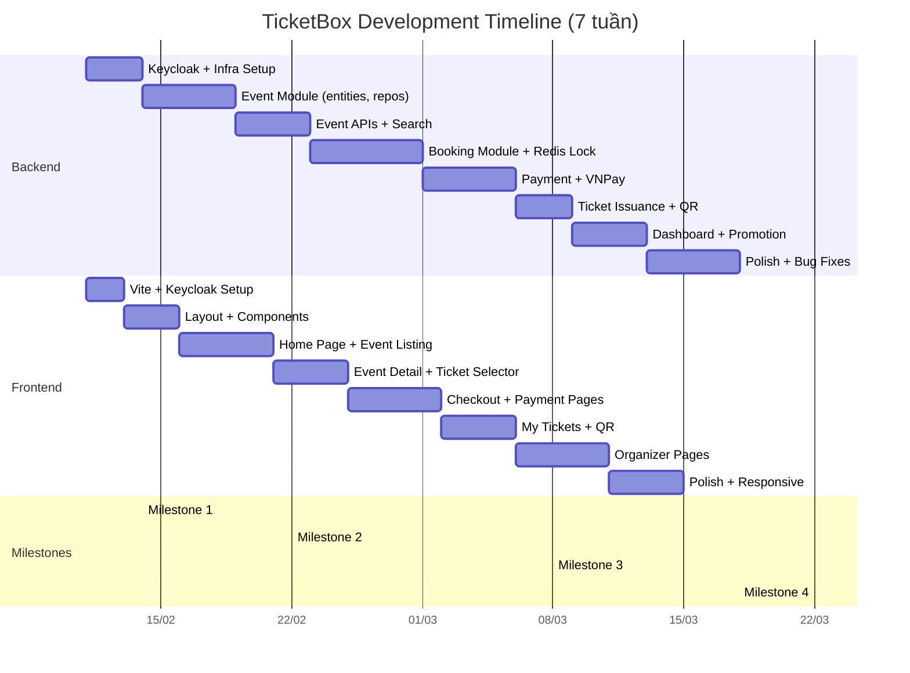

# 🎫 TicketBox Flash Ticket System — Kế Hoạch Phát Triển

> **Nhóm**: 2 người (Person A: Frontend, Person B: Backend)
> **Mục tiêu**: MVP demo được trước giảng viên
> **Giả định**: Part-time ~25h/tuần/người, deadline pressure
> **Tạo ngày**: 2026-02-10

---

# MỤC LỤC

| Phần | Nội dung |
|------|----------|
| **Part 1** | Frontend Development Plan (Person A) |
| **Part 2** | Backend Development Plan (Person B) |
| **Part 3** | Collaboration & Synchronization |
| **Part 4** | MVP Feature Checklist |
| **Part 5** | Best Practices & Notes |

---

# 📱 PART 1: FRONTEND DEVELOPMENT PLAN (Person A)

## 1.1. Pre-Development Setup (Tuần 0 — 4-6h)

- [ ] **Môi trường**: Node.js 18+, VS Code + extensions (ESLint, Prettier, Tailwind IntelliSense)
- [ ] Clone repo, `cd frontend/`, `npm install`
- [ ] Verify Vite + React 18 + TypeScript chạy OK (`npm run dev`)
- [ ] Cài thêm dependencies:
  ```
  npm install @tanstack/react-query axios react-router-dom keycloak-js
  npm install antd @ant-design/icons dayjs
  npm install -D @types/react-router-dom
  ```
- [ ] Setup folder structure (xem mục 1.4)
- [ ] Kết nối Keycloak-js → test login redirect → lấy được JWT token
- [ ] Cấu hình Axios interceptor gắn Bearer token vào header
- [ ] Test `GET http://localhost:8080/api/health` (qua Gateway) → nhận 200 OK

> [!IMPORTANT]
> Frontend phụ thuộc mạnh vào Backend cung cấp API. Khi Backend chưa ready, dùng **mock data** (file JSON hoặc MSW – Mock Service Worker) để unblock.

---

## 1.2. Phase Breakdown

### PHASE 1: Core MVP (Tuần 1–3) — ~60h

Mục tiêu: Buyer có thể browse events, xem chi tiết, chọn vé. Auth hoạt động.

| # | Task | Priority | Est. | Backend Dependency |
|---|------|----------|------|--------------------|
| 1 | **Keycloak Integration** — init Keycloak, `useAuth` hook, token refresh, protected routes | P0 | 6h | Keycloak realm + client ready |
| 2 | **Layout Shell** — Header (logo, nav, user dropdown), Footer, Sidebar | P0 | 4h | Không |
| 3 | **Home Page** — Hero banner, featured events carousel, categories grid | P0 | 8h | `GET /api/events?featured=true`, `GET /api/categories` |
| 4 | **Event Listing Page** — Grid/list view, search bar, category filter, city filter, sort, pagination | P0 | 10h | `GET /api/events?search=&category=&city=&page=` |
| 5 | **Event Detail Page** — Banner, description, schedule, venue info, ticket types table, "Mua vé" button | P0 | 10h | `GET /api/events/{slug}` |
| 6 | **Ticket Selector Component** — Chọn loại vé, quantity picker, subtotal | P0 | 6h | Dữ liệu `ticket_types` trong event detail response |
| 7 | **Responsive Design** — Mobile-first, tablet breakpoints | P1 | 6h | Không |
| 8 | **Loading States & Error Pages** — Skeleton loaders, 404, 500, empty states | P1 | 4h | Không |
| 9 | **EventCard reusable component** — Thumbnail, title, date, price, venue badge | P0 | 3h | Không |
| 10 | **Category Page** — Listing events by category | P1 | 3h | `GET /api/events?category={slug}` |

### PHASE 2: Booking & Payment (Tuần 3–5) — ~50h

Mục tiêu: Buyer hoàn thành flow mua vé end-to-end.

| # | Task | Priority | Est. | Backend Dependency |
|---|------|----------|------|--------------------|
| 11 | **Checkout Page** — Order summary, attendee form, apply voucher, "Thanh toán" | P0 | 10h | `POST /api/bookings`, `POST /api/promotions/validate` |
| 12 | **Payment Redirect** — Redirect to VNPay, handle return URL | P0 | 6h | `POST /api/payments/create-url`, VNPay sandbox ready |
| 13 | **Payment Result Pages** — Success / Failure / Pending | P0 | 4h | `GET /api/payments/{orderId}/status` |
| 14 | **My Tickets Page** — List vé đã mua, filter by upcoming/past | P0 | 8h | `GET /api/tickets/my-tickets` |
| 15 | **Ticket Detail + QR** — Thông tin vé chi tiết, hiển thị QR Code | P0 | 6h | `GET /api/tickets/{id}` |
| 16 | **Order History** — Danh sách đơn hàng, trạng thái | P1 | 6h | `GET /api/orders/my-orders` |
| 17 | **Countdown Timer** — Cho reservation expiration (15 phút) | P1 | 4h | Không |
| 18 | **Cart Context** — Global state quản lý items đang chọn | P1 | 4h | Không |

### PHASE 3: Organizer + Admin + Polish (Tuần 5–7) — ~45h

| # | Task | Priority | Est. | Backend Dependency |
|---|------|----------|------|--------------------|
| 19 | **Organizer: Create Event Form** — Multi-step form (basic info, schedule, venue, ticket types, images) | P1 | 12h | `POST /api/organizer/events` |
| 20 | **Organizer: My Events** — List own events, status badges, edit/delete | P1 | 6h | `GET /api/organizer/events` |
| 21 | **Organizer: Dashboard** — Cards: tổng vé bán, doanh thu, events | P1 | 8h | `GET /api/organizer/dashboard` |
| 22 | **Organizer: Event Detail (Analytics)** — Orders list, sales chart | P2 | 6h | `GET /api/organizer/events/{id}/stats` |
| 23 | **Admin: Category Management** — CRUD categories | P2 | 4h | `GET/POST/PUT/DELETE /api/admin/categories` |
| 24 | **Admin: Event Approval** — List pending events, approve/reject | P2 | 4h | `GET /api/admin/events?status=PENDING` |
| 25 | **Chat Widget** (AI Chatbot) — Floating button, message list, input | P2 | 5h | `POST /api/chat` |

### PHASE 4: Flash Sale Feature (Tuần 6–7) — ~15h

| # | Task | Priority | Est. | Backend Dependency |
|---|------|----------|------|--------------------|
| 26 | **Flash Sale Banner** — Countdown, special styling | P1 | 4h | Flash sale data in event response |
| 27 | **Queue/Waiting Room UI** — "Đang xếp hàng..." khi high traffic | P2 | 5h | `POST /api/bookings` response codes |
| 28 | **Real-time Stock Display** — Hiển thị "còn X vé" updating | P2 | 6h | WebSocket or polling |

---

## 1.3. User Flows Priority List

| # | User Flow | Role | Priority | Backend APIs Needed | Est. | Test Criteria |
|---|-----------|------|----------|---------------------|------|---------------|
| 1 | **Browse & Search Events** | Buyer | P0 | `GET /api/events`, `GET /api/categories` | 15h | User tìm được event theo tên, category, city |
| 2 | **View Event Detail** | Buyer | P0 | `GET /api/events/{slug}` | 8h | Hiển thị đầy đủ info, ticket types, venue |
| 3 | **Login via Keycloak** | All | P0 | Keycloak realm ready | 6h | Redirect → login → redirect back → token stored |
| 4 | **Buy Ticket (end-to-end)** | Buyer | P0 | Booking + Payment APIs | 20h | Chọn vé → checkout → VNPay → nhận vé QR |
| 5 | **View My Tickets** | Buyer | P0 | `GET /api/tickets/my-tickets` | 8h | Thấy list vé + QR code |
| 6 | **Create Event** | Organizer | P1 | `POST /api/organizer/events` | 12h | Tạo event → hiện trên listing |
| 7 | **View Sales Dashboard** | Organizer | P1 | Dashboard APIs | 8h | Thấy stats chính xác |
| 8 | **Manage Categories** | Admin | P2 | Admin CRUD APIs | 4h | CRUD hoạt động |
| 9 | **Chat with AI Bot** | Buyer | P2 | Chat API | 5h | Hỏi → nhận trả lời hữu ích |

---

## 1.4. Component Architecture

### Folder Structure (Đề xuất)

```
frontend/src/
├── api/                        # API clients
│   ├── axiosClient.ts          # Base config + interceptor
│   ├── eventApi.ts             # Event endpoints
│   ├── bookingApi.ts           # Booking endpoints
│   ├── paymentApi.ts           # Payment endpoints
│   ├── userApi.ts              # User endpoints
│   └── chatApi.ts              # Chat endpoints
│
├── components/                 # Reusable UI components
│   ├── common/                 # Button, Modal, Loading, EmptyState, ErrorBoundary
│   ├── layout/                 # Header, Footer, Sidebar, MainLayout, OrganizerLayout
│   ├── event/                  # EventCard, EventGrid, TicketSelector, CategoryBadge
│   ├── booking/                # OrderSummary, CountdownTimer, QuantityPicker
│   └── chat/                   # ChatWidget, MessageBubble
│
├── pages/                      # Page-level components
│   ├── Home/                   # HomePage.tsx
│   ├── Events/                 # EventListPage.tsx, EventDetailPage.tsx
│   ├── Checkout/               # CheckoutPage.tsx, PaymentResultPage.tsx
│   ├── MyTickets/              # MyTicketsPage.tsx, TicketDetailPage.tsx
│   ├── Organizer/              # DashboardPage, CreateEventPage, MyEventsPage
│   └── Admin/                  # CategoryManagePage, EventApprovalPage
│
├── hooks/                      # Custom hooks
│   ├── useAuth.ts              # Keycloak integration
│   ├── useEvents.ts            # React Query for events
│   ├── useBooking.ts           # Booking logic
│   └── useDebounce.ts          # Search debounce
│
├── context/                    # React Context
│   ├── AuthContext.tsx          # Auth state provider
│   └── CartContext.tsx          # Cart state
│
├── types/                      # TypeScript interfaces
│   ├── event.ts                # Event, TicketType, Category, Venue
│   ├── booking.ts              # Order, OrderItem, Ticket
│   ├── user.ts                 # User, OrganizerProfile
│   └── common.ts               # PagedResponse, ApiError
│
├── utils/                      # Utility functions
│   ├── formatters.ts           # formatCurrency, formatDate
│   ├── constants.ts            # API_BASE_URL, KEYCLOAK_CONFIG
│   └── validators.ts           # Form validation
│
├── router/                     # Routing config
│   └── AppRouter.tsx           # Route definitions + guards
│
├── App.tsx
├── main.tsx
└── index.css
```

### Shared Components (xây trước)

| Component | Mô tả | Cần cho |
|-----------|--------|---------|
| `MainLayout` | Header + Content + Footer | Tất cả public pages |
| `OrganizerLayout` | Sidebar + Content | Organizer pages |
| `EventCard` | Card sự kiện (thumbnail, title, date, price) | Home, Listing, Search |
| `TicketSelector` | Chọn loại vé + số lượng | Event Detail, Checkout |
| `ProtectedRoute` | Guard dựa trên auth + role | Routes cần login |
| `Loading / Skeleton` | Loading states | Everywhere |
| `EmptyState` | "Không có dữ liệu" | Lists, search |

---

## 1.5. Critical Blockers & Waiting Points

| Blocker | Khi nào bị block | Workaround |
|---------|-------------------|------------|
| **Keycloak chưa setup** | Tuần 0 - không thể test auth | Dùng hard-coded mock token |
| **Event APIs chưa ready** | Tuần 1 - không có data hiển thị | Mock JSON files / MSW |
| **Booking API chưa ready** | Tuần 3 - không thể code checkout | Mock response, focus UI |
| **VNPay chưa integrate** | Tuần 4 - không test payment flow | Mock redirect, fake success page |
| **Ticket/QR APIs chưa ready** | Tuần 4 - My Tickets trống | Mock ticket data |

### Mock Data Strategy

```typescript
// src/mocks/events.ts — Dùng khi Backend chưa ready
export const mockEvents: Event[] = [
  {
    id: "uuid-1",
    title: "Rock Storm 2026",
    slug: "rock-storm-2026",
    shortDescription: "Đại nhạc hội Rock lớn nhất năm",
    startDatetime: "2026-03-15T19:00:00+07:00",
    venueName: "SVĐ Mỹ Đình",
    city: "Hà Nội",
    bannerUrl: "/images/mock-banner.jpg",
    ticketTypes: [
      { id: "tt-1", name: "Regular", price: 500000, quantityAvailable: 100 },
      { id: "tt-2", name: "VIP", price: 1500000, quantityAvailable: 20 },
    ],
    status: "PUBLISHED",
    isFeatured: true,
    categories: [{ name: "Âm nhạc", slug: "am-nhac" }],
  },
  // ... thêm 5-10 events nữa
];
```

---

# ⚙️ PART 2: BACKEND DEVELOPMENT PLAN (Person B)

## 2.1. Pre-Development Setup (Tuần 0 — 6-8h)

### 2.1.1. Môi trường

- [ ] JDK 17+ (recommend 21), Maven 3.8+, IntelliJ IDEA
- [ ] Docker Desktop installed + đủ RAM (8GB+ recommended)
- [ ] Git bash / terminal sẵn sàng

### 2.1.2. Docker Compose

- [ ] `docker-compose up -d` — khởi động tất cả infrastructure:
  - **PostgreSQL** (:5432) — pgvector image
  - **MongoDB** (:27017) — user data
  - **Redis** (:6379) — cache + distributed lock
  - **Kafka** (:9092) + Zookeeper (:2181) — message queue
  - **Keycloak** (:9090) — auth server
  - **pgAdmin** (:5050) — database GUI

### 2.1.3. Database Setup

- [ ] Tạo database `ticketbox_db` trong PostgreSQL
- [ ] Chạy migration: `V2__complete_schema.sql` → verify 24 tables tạo thành công
- [ ] Chạy MongoDB schema: `user_service_schema.js` → verify collections + indexes
- [ ] Verify sample data đã insert (categories, venues, promotions)

### 2.1.4. Keycloak Setup (CRITICAL — Person A cần ngay)

- [ ] Truy cập `http://localhost:9090` → login `admin/admin`
- [ ] **Create Realm**: `ticketbox`
- [ ] **Create Clients**:
  - `ticketbox-api` (confidential) — cho Backend services
  - `ticketbox-frontend` (public) — cho React SPA
  - Set Valid Redirect URIs: `http://localhost:5173/*`
  - Set Web Origins: `http://localhost:5173`
- [ ] **Create Realm Roles**: `ADMIN`, `ORGANIZER`, `BUYER`
- [ ] **Create Test Users**:

| Username | Email | Password | Roles |
|----------|-------|----------|-------|
| `admin` | admin@ticketbox.vn | `admin123` | ADMIN |
| `organizer1` | org@ticketbox.vn | `org123` | ORGANIZER |
| `buyer1` | buyer@ticketbox.vn | `buyer123` | BUYER |

- [ ] Test lấy token: `POST http://localhost:9090/realms/ticketbox/protocol/openid-connect/token`
- [ ] **Chia sẻ cho Person A**: Client ID, Realm name, Keycloak URL

### 2.1.5. Spring Security + Keycloak

- [ ] Config `SecurityConfig.java` trong API Gateway và Core Service
- [ ] Test JWT validation: call API với Bearer token → 200 OK
- [ ] Test unauthorized: call API không có token → 401

---

## 2.2. Service Implementation Priority

### Trạng thái hiện tại (Đánh giá từ source code)

```
core-service/   → Skeleton (chỉ có CoreServiceApplication.java)
order/          → Có code cũ (ecommerce package) — CẦN MERGE + REFACTOR
user-service/   → Cần review + refactor
apigateway/     → Có sẵn, cần update config
eureka/         → Có sẵn ✅
configserver/   → Có sẵn ✅
```

> [!WARNING]
> **`order/` service** hiện dùng package `com.ecommerce.order` với 27 files. Cần **merge logic vào `core-service/`** và rename package sang `com.ticketbox.core.booking`. Xóa `order/` folder sau khi merge xong.

---

### SERVICE 1: Core Service — Event Module (P0, Tuần 1–2)

**Package**: `com.ticketbox.core.event`

| Layer | Files cần tạo |
|-------|--------------|
| **Entity** | `Event.java`, `TicketType.java`, `Category.java`, `Venue.java`, `VenueSector.java`, `EventImage.java`, `EventCategory.java` |
| **Repository** | `EventRepository.java`, `TicketTypeRepository.java`, `CategoryRepository.java`, `VenueRepository.java` |
| **DTO** | `EventResponse.java`, `EventDetailResponse.java`, `EventSearchRequest.java`, `TicketTypeDTO.java`, `CategoryResponse.java`, `CreateEventRequest.java` |
| **Service** | `EventService.java`, `EventServiceImpl.java`, `CategoryService.java` |
| **Controller** | `EventController.java` (public), `OrganizerEventController.java` (organizer), `AdminCategoryController.java` (admin) |

**API Endpoints cần tạo (Phase 1)**:

| Method | Endpoint | Auth | Mô tả | Priority |
|--------|----------|------|-------|----------|
| GET | `/api/events` | No | Listing + search + filter + pagination | P0 |
| GET | `/api/events/{slug}` | No | Chi tiết event + ticket types | P0 |
| GET | `/api/events/featured` | No | Events nổi bật (is_featured=true) | P0 |
| GET | `/api/categories` | No | All active categories | P0 |
| GET | `/api/categories/{slug}/events` | No | Events theo category | P1 |
| POST | `/api/organizer/events` | ORGANIZER | Tạo event mới (DRAFT) | P1 |
| GET | `/api/organizer/events` | ORGANIZER | My events list | P1 |
| PUT | `/api/organizer/events/{id}` | ORGANIZER | Update event | P1 |
| PATCH | `/api/organizer/events/{id}/publish` | ORGANIZER | Publish event | P1 |
| GET | `/api/admin/categories` | ADMIN | List categories (admin) | P2 |
| POST | `/api/admin/categories` | ADMIN | Create category | P2 |
| PUT | `/api/admin/categories/{id}` | ADMIN | Update category | P2 |

**Est. time**: 20–25h

---

### SERVICE 2: Core Service — Booking Module (P0, Tuần 3–4)

**Package**: `com.ticketbox.core.booking`

Merge logic từ `order/` (ecommerce package) nhưng redesign theo schema mới.

| Layer | Files cần tạo |
|-------|--------------|
| **Entity** | `Order.java`, `OrderItem.java`, `OrderItemSeat.java`, `Ticket.java`, `Reservation.java`, `Cart.java`, `CartItem.java` |
| **Repository** | `OrderRepository.java`, `OrderItemRepository.java`, `TicketRepository.java`, `ReservationRepository.java` |
| **DTO** | `BookingRequest.java`, `BookingResponse.java`, `TicketResponse.java`, `MyOrdersResponse.java` |
| **Service** | `BookingService.java`, `TicketReservationService.java` (Redis Lock), `TicketService.java` (QR gen), `OrderExpirationService.java` (@Scheduled) |
| **Controller** | `BookingController.java`, `TicketController.java` |

**API Endpoints**:

| Method | Endpoint | Auth | Mô tả | Priority |
|--------|----------|------|-------|----------|
| POST | `/api/bookings` | BUYER | Tạo booking (reserve tickets, create order) | P0 |
| GET | `/api/orders/my-orders` | BUYER | Lịch sử đơn hàng | P0 |
| GET | `/api/orders/{id}` | BUYER | Chi tiết đơn hàng | P0 |
| GET | `/api/tickets/my-tickets` | BUYER | Vé đã mua | P0 |
| GET | `/api/tickets/{id}` | BUYER | Chi tiết vé + QR data | P0 |
| POST | `/api/tickets/{id}/validate` | ORGANIZER | Validate ticket (check-in) | P2 |

**Est. time**: 20–25h

---

### SERVICE 3: Core Service — Payment Module (P0, Tuần 4–5)

**Package**: `com.ticketbox.core.payment`

| Layer | Files cần tạo |
|-------|--------------|
| **Entity** | `Transaction.java`, `Refund.java` |
| **Repository** | `TransactionRepository.java` |
| **Service** | `PaymentService.java`, `VNPayService.java`, `PaymentEventPublisher.java` (Kafka) |
| **Controller** | `PaymentController.java` |

**API Endpoints**:

| Method | Endpoint | Auth | Mô tả | Priority |
|--------|----------|------|-------|----------|
| POST | `/api/payments/create-url` | BUYER | Tạo VNPay payment URL | P0 |
| GET | `/api/payments/vnpay-return` | No | VNPay redirect callback | P0 |
| POST | `/api/payments/vnpay-ipn` | No | VNPay server-to-server notify | P0 |
| GET | `/api/payments/{orderId}/status` | BUYER | Check payment status | P0 |

**Est. time**: 15–20h

---

### SERVICE 4: Core Service — Dashboard Module (P1, Tuần 5–6)

**Package**: `com.ticketbox.core.dashboard`

| Method | Endpoint | Auth | Mô tả | Priority |
|--------|----------|------|-------|----------|
| GET | `/api/organizer/dashboard` | ORGANIZER | Overview stats (total events, revenue, tickets) | P1 |
| GET | `/api/organizer/events/{id}/stats` | ORGANIZER | Per-event analytics | P1 |
| GET | `/api/organizer/events/{id}/orders` | ORGANIZER | Orders for specific event | P1 |

**Est. time**: 8–10h

---

### SERVICE 5: Core Service — Promotion Module (P1, Tuần 5)

**Package**: `com.ticketbox.core.promotion`

| Method | Endpoint | Auth | Mô tả | Priority |
|--------|----------|------|-------|----------|
| POST | `/api/promotions/validate` | BUYER | Validate voucher code | P1 |
| POST | `/api/promotions/apply` | BUYER | Apply voucher to order | P1 |

**Est. time**: 6–8h

---

### SERVICE 6: User Service (P1, Tuần 2)

Refactor `user-service/` hiện tại:
- Rename package → `com.ticketbox.user`
- Enhance Keycloak sync
- Add OrganizerProfile endpoints

| Method | Endpoint | Auth | Mô tả | Priority |
|--------|----------|------|-------|----------|
| GET | `/api/users/me` | Any | Lấy profile hiện tại | P0 |
| PUT | `/api/users/me` | Any | Update profile | P1 |
| GET | `/api/users/{id}/organizer-profile` | Any | Lấy organizer profile | P1 |

**Est. time**: 8–10h

---

### SERVICE 7: AI Service (P2, Tuần 6–7)

Chỉ làm khi đã xong MVP. Skip nếu không kịp.

**Est. time**: 15–20h

---

## 2.3. API Development Roadmap

### PHASE 1: Core APIs cho Frontend MVP (Tuần 1–3)

**Tuần 1 (P0 — Frontend đang chờ)**:
1. `GET /api/events` — listing + search + pagination
2. `GET /api/events/{slug}` — event detail
3. `GET /api/events/featured` — featured events
4. `GET /api/categories` — all categories
5. `GET /api/users/me` — user profile
6. Health check endpoint: `GET /actuator/health`

**Tuần 2 (P0)**:
7. `POST /api/organizer/events` — create event
8. `GET /api/organizer/events` — my events
9. Category filtering trên event listing

**Tuần 3 (P0)**:
10. `POST /api/bookings` — create booking + Redis lock
11. `GET /api/orders/my-orders` — order history
12. `GET /api/orders/{id}` — order detail

### PHASE 2: Payment + Tickets (Tuần 4–5)

13. VNPay integration (create URL, return, IPN)
14. `GET /api/tickets/my-tickets` — ticket listing
15. `GET /api/tickets/{id}` — ticket detail + QR
16. Kafka: `payment.success` event → ticket issuance

### PHASE 3: Advanced (Tuần 5–7)

17. Dashboard APIs
18. Promotion validate/apply
19. Admin APIs
20. AI Service (if time permits)

---

## 2.4. Database Migration Strategy

### Flyway Setup

```
core-service/src/main/resources/db/migration/
├── V1__init_schemas.sql          # CREATE SCHEMA statements
├── V2__complete_schema.sql       # Full schema (hiện tại đã có)
├── V3__sample_data.sql           # Dev sample data (events, venues)
└── V4__xxx.sql                   # Future changes (NEVER edit V2)
```

> [!CAUTION]
> **KHÔNG BAO GIỜ** sửa migration đã chạy (V1, V2). Nếu cần thay đổi schema → tạo `V3__alter_xxx.sql` mới.

### Sample Data Seeding

File `V2__complete_schema.sql` đã có:
- ✅ 7 categories + 3 sub-categories
- ✅ 5 venues + 4 sectors cho SVĐ Mỹ Đình
- ✅ 2 promotions

**Cần thêm**:
- [ ] 5-10 sample events (PUBLISHED) với ticket types → `V3__sample_events.sql`
- [ ] Link events với categories qua `event_categories`
- [ ] Add event_images cho mỗi event

---

## 2.5. Integration Points — APIs Frontend Cần NGAY

### Priority 0 (Tuần 1 — Frontend bị block nếu không có)

| API | Response structure (simplified) |
|-----|------|
| `GET /api/categories` | `[{ id, name, slug, iconUrl, parentId }]` |
| `GET /api/events?page=0&size=12` | `{ content: [{ id, title, slug, shortDescription, startDatetime, venueName, city, bannerUrl, minPrice, status }], totalPages, totalElements }` |
| `GET /api/events/{slug}` | `{ id, title, slug, description, startDatetime, endDatetime, venue: {name, address, city}, ticketTypes: [{id, name, price, quantityAvailable, maxPerOrder}], images: [{url, type}], organizer: {name, logoUrl} }` |
| `GET /api/users/me` | `{ id, email, displayName, roles: ["BUYER"] }` |

### Priority 1 (Tuần 3 — Cần cho checkout flow)

| API | Response structure (simplified) |
|-----|------|
| `POST /api/bookings` | `{ orderId, orderNumber, totalAmount, expiresAt, paymentUrl? }` |
| `POST /api/payments/create-url` | `{ paymentUrl: "https://sandbox.vnpayment.vn/..." }` |

---

## 2.6. Critical Blockers & Dependencies

| Blocker | Impact | Mitigation |
|---------|--------|------------|
| Keycloak setup chưa xong | Frontend không test được auth | Ưu tiên setup Tuần 0, chia sẻ credentials ngay |
| Schema quá phức tạp cho MVP | Mất thời gian code entity mapping | Đơn giản hóa: bỏ qua venues, seats, seat_inventory ban đầu |
| VNPay sandbox approval | Không test payment E2E | Dùng mock payment service trước, integrate VNPay sau |
| Kafka complexity | Mất thời gian config | Phase 1: dùng sync call thay Kafka, add Kafka Phase 2 |

---

# 🤝 PART 3: COLLABORATION & SYNCHRONIZATION

## 3.1. Parallel Work Opportunities



### Weekly Parallel Plan

| Tuần | Frontend (Person A) | Backend (Person B) | Integration Point |
|------|--------------------|--------------------|-------------------|
| **0** | Setup Vite, Keycloak-js, folder structure | Docker Compose, Keycloak realm/roles, DB migration | ✅ Share Keycloak credentials |
| **1** | Layout components, Home page (mock data), Event listing (mock data) | Event entities, Event APIs (`GET /api/events`, categories) | ✅ Test listing với real API |
| **2** | Event Detail page, Ticket selector, Search + filters | Organizer event APIs, User Service refactor | ✅ Test event detail + search |
| **3** | Checkout page UI, Payment flow UI | Booking API + Redis Lock, Order APIs | ✅ Test booking flow |
| **4** | Payment result pages, My Tickets page | VNPay integration, Ticket issuance + QR | ✅ Full payment E2E |
| **5** | Organizer pages (create event, my events) | Dashboard APIs, Promotion APIs | ✅ Organizer flow |
| **6** | Polish, responsive, admin pages | AI Service (optional), bug fixes | ✅ Final integration |
| **7** | Final polish, demo prep | Demo data, documentation | ✅ Demo rehearsal |

---

## 3.2. Integration Milestones

### Milestone 1: Authentication Works (End of Tuần 0)

- **Frontend**: Login button → Keycloak redirect → back to app with token
- **Backend**: API Gateway validates JWT, passes `userId` to services
- **Test**: Call a protected endpoint from React app → get 200
- **Nếu fail**: Debug Keycloak config, check CORS, token format

### Milestone 2: Browse Events E2E (End of Tuần 1)

- **Frontend**: Home page shows real events from API, search works
- **Backend**: `GET /api/events` returns paginated data with categories
- **Test**: User mở app → thấy events → search "Rock" → thấy kết quả
- **Nếu fail**: Check API Gateway routing, CORS headers, pagination params

### Milestone 3: Buy Ticket E2E (End of Tuần 4)

- **Frontend**: Full checkout flow renders correctly
- **Backend**: Booking → Payment → Ticket issuance pipeline works
- **Test**: Buyer login → chọn event → chọn vé → thanh toán → nhận vé QR
- **Nếu fail**: Check Redis lock, VNPay callback, Kafka (hoặc sync fallback)

### Milestone 4: MVP Complete (End of Tuần 5-6)

- **Frontend**: All P0 + P1 pages working, responsive
- **Backend**: All P0 + P1 APIs stable
- **Test**: Demo 3 flows: Buyer mua vé, Organizer tạo event, Admin browse
- **Nếu fail**: Focus chỉ Buyer flow, demo recorded video

---

## 3.3. Communication Protocol

### Daily (5 min async — Messenger/Zalo)

- **Frontend** báo: "Hôm nay cần API: `GET /api/events/{slug}` — khi nào ready?"
- **Backend** báo: "API events search đã deploy, response format thay đổi field X"

### API Contract Agreement

**Swagger/OpenAPI**: Backend tạo docs tự động với SpringDoc
```
http://localhost:8082/swagger-ui.html   ← Core Service
http://localhost:8081/swagger-ui.html   ← User Service
```

**Error Response Format (thống nhất)**:
```json
{
  "timestamp": "2026-02-10T22:00:00Z",
  "status": 400,
  "error": "Bad Request",
  "message": "Không đủ vé. Còn lại: 5",
  "path": "/api/bookings",
  "code": "INSUFFICIENT_TICKETS"
}
```

**Pagination Format (thống nhất)**:
```json
{
  "content": [...],
  "page": 0,
  "size": 12,
  "totalElements": 156,
  "totalPages": 13,
  "last": false
}
```

---

## 3.4. Risk Mitigation

| Risk | Probability | Impact | Mitigation |
|------|-------------|--------|------------|
| Backend API chậm hơn Frontend | Cao | Frontend bị block | Frontend dùng MSW mock APIs, trao đổi response structure trước |
| Keycloak integration phức tạp | Trung bình | Block cả 2 | Setup Keycloak Tuần 0. Nếu fail, fallback: tạm skip auth, hardcode userId |
| VNPay sandbox approval delay | Trung bình | Không test payment E2E | Mock payment service: `POST /api/payments/mock` luôn trả success |
| Database schema change | Thấp | Backend phải migrate + recode | FREEZE schema sau Tuần 2. Mọi change phải thảo luận |
| Kafka quá phức tạp | Trung bình | Mất nhiều thời gian config | **Phase 1: KHÔNG dùng Kafka**. Gọi sync (`bookingService.issueTickets()` trực tiếp). Thêm Kafka sau nếu kịp |
| Redis lock bug | Thấp | Over-booking | Unit test kỹ, load test với JMeter nếu kịp |
| Không đủ thời gian | Cao | Không đủ features demo | Luôn giữ MVP runnable. AI Service bỏ phải OK |

---

# 📊 PART 4: MVP FEATURE CHECKLIST

## "4-Week MVP" — Nếu chỉ có 4 tuần

### Must-Have (P0) — Không có thì không demo được

- [ ] **Auth**: Login/Logout via Keycloak (3 roles hoạt động)
- [ ] **Browse Events**: Home page + Event listing + Search + Filter
- [ ] **Event Detail**: Full info + ticket types + "Mua vé" button
- [ ] **Buy Ticket**: Checkout → Payment (VNPay hoặc mock) → Order confirmed
- [ ] **My Tickets**: Xem danh sách vé đã mua + QR code
- [ ] **Sample Data**: 5-10 events đẹp, đủ categories, có ảnh

> ⚡ **Feature demo được end-to-end sớm nhất**: **Buyer Browse → Event Detail → Buy Ticket → View Ticket with QR**. Ưu tiên tuyệt đối flow này.

### Should-Have (P1) — Quan trọng nhưng skip được

- [ ] **Organizer: Create Event** — Multi-step form
- [ ] **Organizer: Dashboard** — Tổng vé bán, doanh thu
- [ ] **Organizer: My Events** — Quản lý events
- [ ] **Flash Sale**: Redis Distributed Lock (demo cùng giảng viên)
- [ ] **Promotions**: Apply voucher code
- [ ] **Responsive Design**: Mobile-friendly

### Nice-to-Have (P2) — Bỏ đi project vẫn OK

- [ ] **AI Chatbot** — RAG-based Q&A
- [ ] **Admin Panel** — Category management, event approval
- [ ] **Seat Selection** — Chọn ghế cụ thể (venue_seats, seat_inventory)
- [ ] **Email Notifications** — Kafka event → send email
- [ ] **Check-in QR Scan** — Organizer scan QR
- [ ] **Advanced Analytics** — Charts, export reports
- [ ] **Real-time Stock Updates** — WebSocket

---

## Khi nào MVP đủ để demo?

| Checklist | Status |
|-----------|--------|
| User login được bằng 3 roles | ☐ |
| Home page hiện events thật (không phải "Lorem ipsum") | ☐ |
| Tìm kiếm event theo tên hoạt động | ☐ |
| Click event → thấy chi tiết + loại vé | ☐ |
| Chọn vé → checkout → thanh toán (mock/real) | ☐ |
| Vào "Vé của tôi" → thấy vé + QR | ☐ |
| Organizer tạo được event mới (ít nhất form cơ bản) | ☐ |
| Có 5+ events demo data đẹp | ☐ |

**Nếu tất cả ☐ → ☑ thì MVP đủ demo.**

---

## AI Service bỏ đi thì project vẫn OK không?

> ✅ **HOÀN TOÀN OK.** AI Service là feature bonus, không ảnh hưởng đến core flows (browse, buy, manage). Database schema `ai_schema` là isolated. Bỏ AI Service chỉ cần xóa chat widget ở frontend. Toàn bộ booking, payment, ticketing vẫn hoạt động bình thường.

---

## Flash Sale — Làm khi nào?

**Đề xuất: Tuần 3–4, cùng lúc với Booking Module.**

Lý do: Flash Sale = booking logic + Redis Lock. Khi code `BookingService`, tích hợp `TicketReservationService` với Redisson lock luôn. Không cần feature flag phức tạp.

**Nếu không kịp**: Booking vẫn hoạt động, chỉ không chống được concurrent race condition. Vẫn demo được basic flow.

**Có thể simplify không?**
- Có. Version đơn giản: dùng `@Transactional` + Optimistic Locking (`@Version` trên `quantity_available`) thay vì Redis Lock. Nhanh hơn nhưng kém ấn tượng hơn khi demo.

---

# ⚠️ PART 5: BEST PRACTICES & NOTES

## For Frontend Developer (Person A)

### ⛔ KHÔNG được làm

- ❌ **KHÔNG** tự code login form hoặc register form — dùng Keycloak redirect
- ❌ **KHÔNG** lưu password, refresh token manual — Keycloak-js tự quản lý
- ❌ **KHÔNG** decode JWT token ở frontend để lấy role — tạo `GET /api/users/me` API
- ❌ **KHÔNG** gọi API trực tiếp đến service (port 8082) — luôn qua Gateway (port 8080)

### ✅ Best Practices

- ✅ Dùng `React Query` cho data fetching — tự cache, retry, refetch
- ✅ Tạo `axiosClient.ts` với interceptor gắn Bearer token
- ✅ Component tách nhỏ, mỗi file < 200 lines
- ✅ TypeScript strict mode — define interfaces cho mọi API response
- ✅ Loading skeleton > spinner > blank screen
- ✅ Error boundary component bọc ngoài mỗi page
- ✅ Format currency: `new Intl.NumberFormat('vi-VN', {style: 'currency', currency: 'VND'})`

### Keycloak-js Setup

```typescript
// src/utils/keycloak.ts
import Keycloak from "keycloak-js";

const keycloak = new Keycloak({
  url: "http://localhost:9090",
  realm: "ticketbox",
  clientId: "ticketbox-frontend",
});

export default keycloak;
```

```typescript
// src/api/axiosClient.ts
import axios from "axios";
import keycloak from "../utils/keycloak";

const axiosClient = axios.create({
  baseURL: "http://localhost:8080/api",
});

axiosClient.interceptors.request.use((config) => {
  if (keycloak.token) {
    config.headers.Authorization = `Bearer ${keycloak.token}`;
  }
  return config;
});

// Auto refresh token
axiosClient.interceptors.response.use(
  (response) => response,
  async (error) => {
    if (error.response?.status === 401) {
      await keycloak.updateToken(30);
      error.config.headers.Authorization = `Bearer ${keycloak.token}`;
      return axios(error.config);
    }
    return Promise.reject(error);
  }
);

export default axiosClient;
```

---

## For Backend Developer (Person B)

### ⛔ KHÔNG được làm

- ❌ **KHÔNG** tự viết JWT generation/validation — Keycloak cung cấp
- ❌ **KHÔNG** hardcode roles trong code — extract từ JWT claims (`realm_access.roles`)
- ❌ **KHÔNG** sửa migration đã chạy — tạo migration mới (V3, V4...)
- ❌ **KHÔNG** return entity trực tiếp ở Controller — luôn dùng DTO
- ❌ **KHÔNG** catch generic `Exception` — catch specific exceptions

### ✅ Best Practices

- ✅ Dùng `@PreAuthorize("hasRole('ORGANIZER')")` cho endpoint security
- ✅ Global exception handler: `@ControllerAdvice` + `@ExceptionHandler`
- ✅ Swagger docs cho mọi endpoint: `@Operation`, `@Parameter`
- ✅ Pagination: dùng Spring `Pageable`, return `Page<DTO>`
- ✅ Soft delete: `WHERE is_deleted = FALSE` trong mọi query
- ✅ Audit columns: dùng `@PrePersist`, `@PreUpdate` hoặc Spring Data JPA Auditing
- ✅ `@Transactional(readOnly = true)` cho read-only methods

### Spring Security Config Example

```java
@Configuration
@EnableWebSecurity
@EnableMethodSecurity
public class SecurityConfig {

    @Bean
    public SecurityFilterChain filterChain(HttpSecurity http) throws Exception {
        http
            .cors(Customizer.withDefaults())
            .csrf(csrf -> csrf.disable())
            .authorizeHttpRequests(auth -> auth
                .requestMatchers("/api/events/**").permitAll()          // Public
                .requestMatchers("/api/categories/**").permitAll()       // Public
                .requestMatchers("/api/payments/vnpay-*").permitAll()   // VNPay callbacks
                .requestMatchers("/api/organizer/**").hasRole("ORGANIZER")
                .requestMatchers("/api/admin/**").hasRole("ADMIN")
                .anyRequest().authenticated()
            )
            .oauth2ResourceServer(oauth2 -> oauth2
                .jwt(jwt -> jwt
                    .jwtAuthenticationConverter(jwtAuthConverter())
                )
            );
        return http.build();
    }

    @Bean
    public JwtAuthenticationConverter jwtAuthConverter() {
        JwtGrantedAuthoritiesConverter converter = new JwtGrantedAuthoritiesConverter();
        converter.setAuthoritiesClaimName("realm_access.roles");
        converter.setAuthorityPrefix("ROLE_");

        JwtAuthenticationConverter jwtConverter = new JwtAuthenticationConverter();
        jwtConverter.setJwtGrantedAuthoritiesConverter(converter);
        return jwtConverter;
    }
}
```

---

## For Both — Git Workflow

### Branch Strategy

```
main                    ← Production-ready, always deployable
├── develop             ← Integration branch
│   ├── feature/fe-event-listing    ← Frontend features
│   ├── feature/fe-checkout
│   ├── feature/be-event-api        ← Backend features
│   ├── feature/be-booking-api
│   └── hotfix/fix-cors-issue
```

### Commit Convention

```
feat(fe): add event listing page with search
feat(be): implement event API with pagination
fix(be): fix CORS config for Keycloak redirect
refactor(be): merge order module into core-service
docs: update API documentation
chore: update docker-compose for Redis
```

### PR Template

```markdown
## What
- Implement event listing API with search and pagination

## Why
- Frontend needs this API to display events on home page

## Testing
- [ ] Unit tests pass
- [ ] Manual testing with Postman
- [ ] Frontend integration verified

## API Changes
- NEW: GET /api/events?search=&page=&size=
```

---

## Testing Requirements (Minimum)

| Layer | Backend | Frontend |
|-------|---------|----------|
| Unit | Service layer tests (MockMvc, JUnit5) | Component tests (React Testing Library) |
| Integration | API integration tests (TestContainers hoặc H2) | E2E smoke test (browser manual) |
| Minimum | Mỗi service class ít nhất 2-3 test cases | Mỗi page render đúng structure |

> [!TIP]
> Đối với bài tập môn học, **manual testing + Postman** là đủ. Automated tests là bonus ấn tượng nhưng không bắt buộc. Ưu tiên **working features** trước **test coverage**.

---

# 📎 APPENDIX

## A. Quick Reference — Ports

| Service | Port | URL |
|---------|------|-----|
| Frontend (Vite) | 5173 | http://localhost:5173 |
| API Gateway | 8080 | http://localhost:8080 |
| User Service | 8081 | http://localhost:8081 |
| Core Service | 8082 | http://localhost:8082 |
| AI Service | 8085 | http://localhost:8085 |
| Eureka | 8761 | http://localhost:8761 |
| Config Server | 8888 | http://localhost:8888 |
| Keycloak | 9090 | http://localhost:9090 |
| PostgreSQL | 5432 | — |
| MongoDB | 27017 | — |
| Redis | 6379 | — |
| Kafka | 9092 | — |
| pgAdmin | 5050 | http://localhost:5050 |
| RabbitMQ | 15672 | http://localhost:15672 |

## B. Quick Reference — Keycloak Cheat Sheet

```bash
# Lấy token (Resource Owner Password Grant — dev only)
curl -X POST http://localhost:9090/realms/ticketbox/protocol/openid-connect/token \
  -d "client_id=ticketbox-frontend" \
  -d "username=buyer1" \
  -d "password=buyer123" \
  -d "grant_type=password"

# Decode JWT token
# Paste token vào https://jwt.io để xem payload
```

## C. Ai làm gì trong tuần đầu tiên?

| Ngày | Person A (Frontend) | Person B (Backend) |
|------|--------------------|--------------------|
| Day 1 | Install Node, clone repo, `npm install`, run dev server | `docker-compose up -d`, verify all containers running |
| Day 2 | Keycloak-js config, test login redirect | Create Keycloak realm, clients, roles, test users |
| Day 3 | `useAuth` hook, ProtectedRoute, user dropdown | Event entities + repositories + Spring Security config |
| Day 4 | Header/Footer/MainLayout components | `GET /api/events` + `GET /api/categories` APIs |
| Day 5 | Home page UI (with mock data initially) | Event search (JPA Specification) + `GET /api/events/{slug}` |
| Day 6 | Connect Home page to real API | Testing + Swagger docs |
| Day 7 | Event listing page + filters | Debug + help Frontend integrate |

---

*Document version: 1.0 | Created: 2026-02-10*
